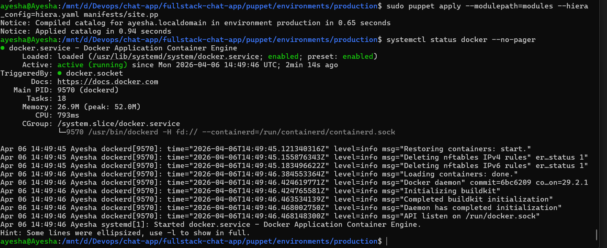
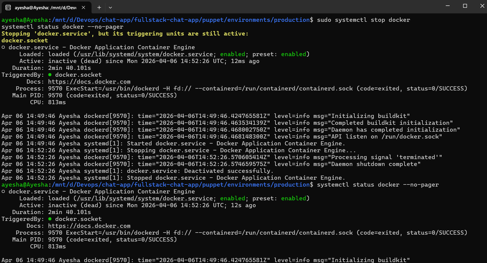
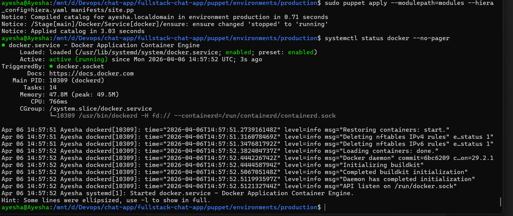

# Puppet Configuration for Chat Platform

This repo manages system configuration for the chat app using Puppet.

It ensures all servers are set up consistently before Kubernetes and application deployment.

## What It Does

- Configures EC2 instances created by Terraform
- Prepares Kubernetes master and worker nodes
- Applies security hardening (SSH, firewall, fail2ban)
- Installs monitoring agents (Node Exporter, logging)
- Keeps systems consistent and self-healing

## How It Fits in Your Stack

`Terraform -> Puppet -> Kubernetes -> ArgoCD`

- Terraform creates infrastructure
- Puppet configures servers
- Kubernetes runs workloads
- ArgoCD handles deployments

## Project Structure

```text
puppet/
  environments/production/
    manifests/site.pp
    modules/
      role/
      profile/
      docker/
      kubernetes/
      monitoring/
      security/
      system/
      users/
    data/ (Hiera configs)

terraform/
  user_data/bootstrap_puppet.sh
```

## Roles

- `role::k8s_master` -> Kubernetes control plane
- `role::k8s_worker` -> Worker nodes
- `role::monitoring` -> Monitoring server

## Profiles (Core Setup)

- Docker setup
- Kubernetes installation (master/worker)
- Monitoring agents
- Security hardening
- System tuning (NTP, sysctl)
- User management

## How to Run

### Option 1: Puppet Server (Recommended)

1. Copy code to Puppet server
2. Launch EC2 using Terraform (with bootstrap script)
3. Sign agent certificates
4. Run:

```bash
puppet agent -t
```

### Option 2: Local Testing

```bash
puppet apply --hiera_config=./hiera.yaml manifests/site.pp
```

## Terraform Integration

Use this in your EC2 config:

```hcl
user_data = templatefile("bootstrap_puppet.sh", {
  role = "k8s_worker"
})
```

This installs Puppet and applies configuration automatically.

## What Each Module Does

- `docker` -> installs and runs Docker
- `kubernetes` -> installs kube tools and joins cluster
- `monitoring` -> installs Node Exporter + logging
- `security` -> SSH hardening, firewall, fail2ban
- `system` -> NTP, sysctl tuning
- `users` -> creates devops user with SSH access

## Key Features

- Idempotent (safe to run multiple times)
- Auto-healing (restores stopped services)
- Scalable (new nodes auto-configure)
- No hardcoding (uses Hiera configs)

## Puppet Execution Proof

Run command:

```bash
sudo puppet apply --modulepath=modules --hiera_config=hiera.yaml manifests/site.pp
```

First run (changes applied):

```text
Notice: /Stage[main]/System/File[/etc/timezone]/content: content changed
Notice: Applied catalog in 0.83 seconds
```

Second run (idempotency proof):

```text
Notice: Applied catalog in 0.71 seconds
```

No changes means the node is already in the desired state.

Puppet ensures idempotent configuration management:
- First run applies required changes.
- Later runs do not change compliant resources.

Proof screenshot:



## Real System Proof

Use these commands and add screenshots/output in your submission.

Docker proof (if Docker profile is included):

```bash
docker --version
systemctl status docker --no-pager
```

Security proof:

```bash
grep PermitRootLogin /etc/ssh/sshd_config
```

Expected:

```text
PermitRootLogin no
```

System config proof:

```bash
cat /etc/timezone
```

Security and service-state screenshot:



## Demo: Self-Healing

<<<<<<< HEAD
Break state intentionally:

```bash
sudo systemctl stop docker
```

Re-apply Puppet:

```bash
sudo puppet apply --modulepath=modules --hiera_config=hiera.yaml manifests/site.pp
```

Validate healed state:

```bash
systemctl status docker --no-pager
```
=======
>>>>>>> 34e1f579b70112092cccdd016496a95b9a9979c6

Expected:

```text
Active: active (running)
```

This demonstrates Puppet automatically restores drifted services to the declared state.

Self-healing screenshot:



## Demo Ideas

- Run Puppet twice -> no changes second time
- Stop Docker -> Puppet restarts it
- Add new node -> auto configured
- Check SSH -> root login disabled

## Before Production

- Replace SSH keys
- Secure secrets (use eyaml or Vault)
- Rotate Kubernetes join tokens
